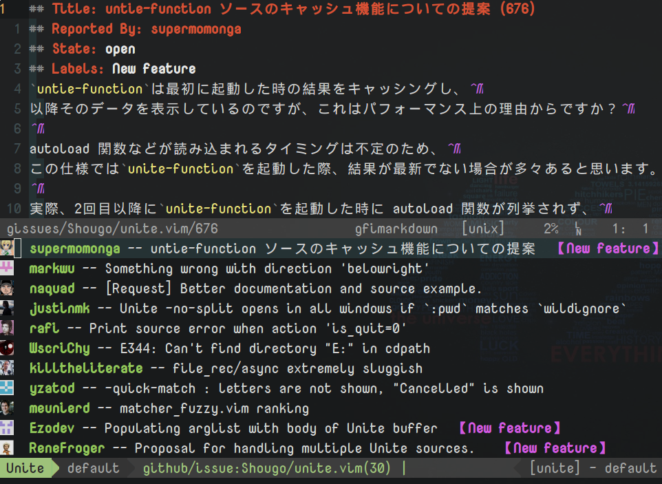

## What the hell?

I suppose you know what alfred-workflow is.
This vim plugin is a collection of unite.vim extentions as a alternative to it.

### github events


Fetch recent github events of a certain user.

### github feeds

Fetch github timeline of a certain user(defaults to g:github_user).

### github repository searching

Search for github repos by keywords.

### github issues

NOTE:

* In order edit issues or create new issue, you'll need [github-issues.vim](https://github.com/jaxbot/github-issues.vim)
* The default repository(if input omitted) is fetched by `git remote -v`.
* You could use input to specify a certain project, in the format of 'owner/repo'



### gist user

NOTE:This feature requires [gist-vim](https://github.com/mattn/gist-vim).


List public gists created by a certain user(defaults to g:github_user).
Actions:

* edit, open with `:Gist id`.
* start, open in a browser.

### gist searching

Search for gists.
Similar to gist-user.

### reddit

Fetch hot topics from reddit.
use `g:unite#workflow#reddit#front` to specify user front feed json url.
Should be like this `http://www.reddit.com/.json?feed={hash}&user={username}`.
If not, the fetching scope will be 'all'.
If used with input, the input is taken as subreddit like this:


### wikipedia

Search for wiki, list matching entries, open selected in a browser.

### youtube

Search youtube, playlist/channel/video ...

### apropos

Fast manpage access.


### toilet

Note: this feature requires executable 'toilet' or 'figlet'.

Use `g:unite#workflow#figlet_fonts#dir` to specify where the fonts are stored,
defaults to `/usr/share/figlet`.


### emoji

Note: You may need extra font packages for correct displaying.
For example, arch users need ttf-symbola in AUR.

Search for emoji by description.


### v2ex

Latest topics of http://www.v2ex.com


### youdao

有道词典/翻译


### musicbox

网易云音乐搜索


## Installation

You need these plugins installed and loaded.

* [unite.vim](https://github.com/shougo/unite.vim)
* [webapi-vim](https://github.com/mattn/webapi-vim)
* [github-issues.vim](https://github.com/jaxbot/github-issues.vim) for github issue editing/creating.
* [gist-vim](https://github.com/mattn/gist-vim) for gist sources.

Then just use your preferred managing tool for this plugin.
If you'd like to load just a part of these features. I suggest that you use neobundle.vim:

``` vim
NeoBundleLazy 'farseer90718/unite-workflow', {
            \ 'unite_sources' : [ your-list ],
            \ 'depends' : [
            \   'mattn/webapi-vim',
            \   'mattn/gist-vim',
            \   'jaxbot/github-issues.vim']
            \ }
```

## Customization

* `g:unite#workflow#show_icon` 0 to disable avatar display.
* `g:unite#workflow#reddit#front` as described above.
* `g:unite#workflow#figlet_fonts#dir` as described above.
* `g:unite#workflow#player` defaults to 'mplayer'.

Example:

``` vim
let g:unite#workflow#reddit#front = 'http://www.reddit.com/.json?feed=foo&user=bar'
call unite#custom#profile(
            \ 'source/github/search, source/github/event, '.
            \ 'source/github/feed, source/gist/search, '.
            \ 'source/gist/user, source/v2ex, '.
            \ 'source/reddit, source/wikipedia',
            \ 'context', {
            \   'keep_focus' : 1,
            \   'no_quit' : 1
            \ })
call unite#custom#profile(
            \ 'source/youdao, source/toilet',
            \ 'context', {
            \   'max_multi_lines' : 20,
            \   'winheight' : 20
            \ })
nnoremap <leader>t  :Unite youdao:<C-R><C-W><CR>
```

## Tips

* Press `<C-L>` to refresh (change input in a faster way) in some sources.
* Some sources may have specialized actions, you can check the action list to find out.

## Contributing

* Bug report, feature request, other discussions are always welcome.
* Pull requests of new workflows are even better.

## License

MIT
